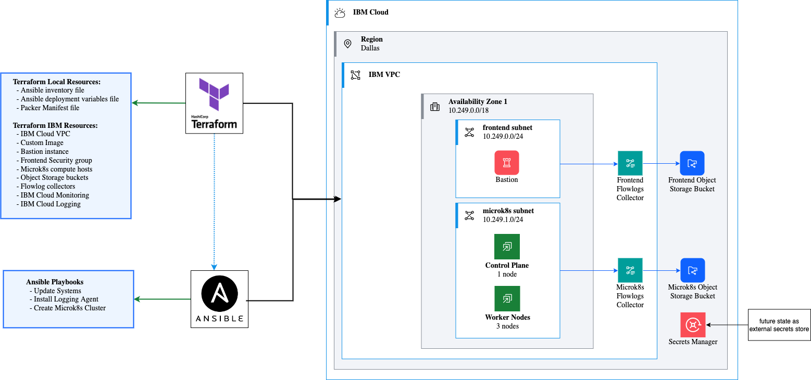
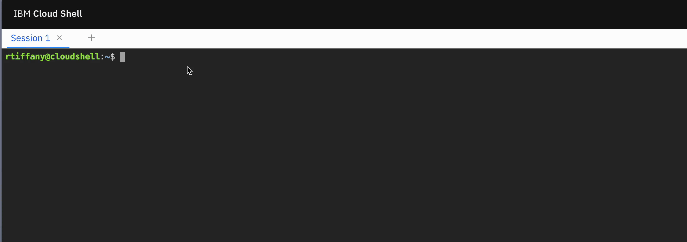

# Deploy a MicroK8s cluster on IBM Cloud VPC :rocket:

In this guide we will deploy a testing MicroK8s cluster on IBM Cloud VPC using Terraform and Ansible. Terraform is an IaC tool that will provision the VPC infrastructure and Ansible will configure the MicroK8s cluster.

This guide is written to utilize [IBM Cloud Shell][cloud-shell] as the development environment. Cloud Shell is a free, browser-based shell environment that includes Terraform, Ansible, and the IBM Cloud CLI. If you prefer to use your own environment, see [here](./LOCAL.md). 



## Pre-requisites

- IBM Cloud API Key. See [here](https://cloud.ibm.com/docs/account?topic=account-userapikey#create_user_key) for instructions on how to create one via the Portal.

## Configuring Cloud Shell

The default version of Terraform in Cloud Shell is failry out of date. You can use the [`tfswitch`](https://tfswitch.warrensbox.com/) command to install a newer version. Invoking `tfswitch` will present a menu of available versions. Select the latest version and it will be installed in your Cloud Shell session.



It is also recommended that you run an update on the Cloud Shell environment to ensure that all the latest packages are installed.

```bash
ibmcloud plugin update --all 
```

## Deploying the cluster

With Cloud Shell up to date and the latest Terraform installed, you can start deploying the cluster.

1. Clone this repo and `cd` into the `microk8s-ibmcloud-vpc` directory.

    ```bash
    git clone https://github.com/cloud-design-dev/microk8s-ibmcloud-vpc.git
    cd microk8s-ibmcloud-vpc
    ```

1. Copy the `tfvars-example` to `terraform.tfvars` file and update the values as needed. See [here](./INFO.md) for full list of variables.:

    ```bash
    cp tfvars-example terraform.tfvars
    ```

1. Initialize Terraform:

    ```bash
    terraform init -upgrade
    ```